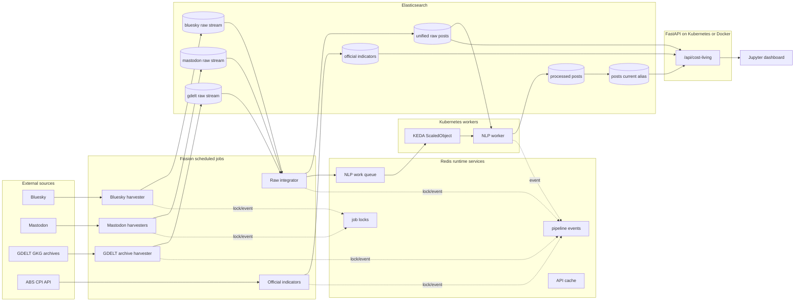

# Cost-of-Living Data Platform

Cloud data pipeline for monitoring Australian cost-of-living pressure across public social discussion, media coverage and official CPI indicators.

The system collects public data from Bluesky, Mastodon and GDELT, normalises raw records into Elasticsearch, runs topic and sentiment processing, and serves chart-ready analytics through a FastAPI REST API. Jupyter notebooks consume the API for exploratory analysis and dashboard-style visualisation.

## Data Sources

| Source | Role | Notes |
| --- | --- | --- |
| Bluesky | Public social discussion | Search-based harvesting with Australian context filtering |
| Mastodon | Public social discussion | Multiple public instances, hashtag-oriented collection |
| GDELT GKG | Media coverage | 15-minute public archive files, treated as media attention rather than direct public sentiment |
| ABS Monthly CPI | Official indicator data | Used for monthly comparison, not causal modelling |

The keyword taxonomy is intentionally explicit and versioned in [data/cost_of_living_keywords.csv](data/cost_of_living_keywords.csv). It covers housing, groceries, energy, fuel, transport, eating out, healthcare, home goods, education, inflation, wages and debt.

## Architecture



The public architecture deliberately has one API path: FastAPI. Fission is used for scheduled ingestion, raw integration and CPI jobs, not as a second copy of the analytics API.

Redis is used for runtime concerns: scheduled job locks, recent pipeline lifecycle events, shared short-lived API response caching and the NLP work queue consumed by KEDA-scaled workers. Worker messages use a bounded retry budget and failed or malformed messages are isolated in `cost_living_pipeline:queue:nlp:dead-letter`. Elasticsearch remains the source of truth for documents, processing status and analytics.

GDELT ingestion uses the public GKG archive list at `masterfilelist.txt`. Incremental harvesting and historical backfill share the same archive processor: list archive metadata, download `.gkg.csv.zip` files, verify md5 checksums, extract CSV rows, filter for Australian cost-of-living signals and bulk index matching records.

## Repository Layout

```text
backend/       Harvesters, NLP worker, Elasticsearch analytics, FastAPI API
database/      Explicit Elasticsearch mappings
deployment/    Docker, Kubernetes and Fission pipeline manifests
docs/          English architecture, data contract, API and operations notes
frontend/      Jupyter dashboard and API validation notebooks
scripts/       Import, inspection, smoke test and stress test utilities
test/          Pytest suite
report/        Anonymised engineering report source and rendered PDF
```

## Elasticsearch Indices

| Index or alias | Purpose |
| --- | --- |
| `cost_living_bluesky_raw_stream` | Bluesky source-specific raw records |
| `cost_living_mastodon_raw_stream` | Mastodon source-specific raw records |
| `cost_living_gdelt_raw_stream` | GDELT source-specific raw records |
| `cost_living_raw_posts` | Unified raw records and NLP processing state |
| `cost_living_processed_posts_write` | Processed write alias managed by ILM rollover |
| `cost_living_processed_posts-000001` | First processed backing index |
| `cost_living_posts_current` | Stable API read alias |
| `cost_living_indicators` | ABS CPI observations |
| `cost_living_monthly_topic_metrics` | Optional monthly rollup |

All defaults in code, `.env.example`, Docker Compose and deployment manifests use the same index names.

## API

The API accepts both `/api/...` and `/api/cost-living/...`. The public prefix used by notebooks and deployment examples is:

```text
/api/cost-living
```

Main endpoints:

```text
GET /api/cost-living/health
GET /api/cost-living/pipeline/status
GET /api/cost-living/pipeline/runtime
GET /api/cost-living/pipeline/events
GET /api/cost-living/pipeline/queues
GET /api/cost-living/cache/status
GET /api/cost-living/rate-limit/status
GET /api/cost-living/metrics
GET /api/cost-living/platforms/plugins
GET /api/cost-living/stats/overview
GET /api/cost-living/trends/documents
GET /api/cost-living/categories/counts
GET /api/cost-living/categories/sentiment
GET /api/cost-living/categories/share
GET /api/cost-living/data-quality/summary
GET /api/cost-living/data-quality/comparison
GET /api/cost-living/media/coverage
GET /api/cost-living/platforms/categories
GET /api/cost-living/trends/categories
GET /api/cost-living/trends/sentiment
GET /api/cost-living/official/comparison
GET /api/cost-living/categories/yoy-change
GET /api/cost-living/categories/volatility
GET /api/cost-living/categories/keywords
GET /api/cost-living/logs/errors
```

Common query parameters:

| Parameter | Values | Notes |
| --- | --- | --- |
| `source_group` | `all`, `social`, `media` | `social = Bluesky + Mastodon`; `media = GDELT` |
| `quality` | `all`, `clean` | `clean` excludes default noisy records |
| `platform` | `bluesky`, `mastodon`, `gdelt` | Comma-separated values are supported |
| `topic` | topic keys | Comma-separated values are supported |
| `start`, `end` | ISO date or datetime | Filters over `created_at` |
| `period` | `day`, `month` | Used by trend endpoints |

The full contract is in [docs/en/frontend_api_contract.md](docs/en/frontend_api_contract.md).

## Local Setup

```bash
python -m venv .venv
source .venv/bin/activate
python -m pip install -r requirements.txt
cp .env.example .env
```

Run tests:

```bash
make test
make public-check
```

Run the API locally:

```bash
make api
```

Swagger UI:

```text
http://127.0.0.1:8000/docs
```

## Docker Compose

Docker Compose starts Elasticsearch, the API and an optional Kibana profile:

```bash
docker compose up --build
```

API health check:

```bash
curl -s http://127.0.0.1:8000/api/cost-living/health
```

Kibana can be started when needed:

```bash
docker compose --profile tools up kibana
```

## Cloud Deployment

The deployment templates are split by responsibility:

| Path | Purpose |
| --- | --- |
| [deployment/kubernetes](deployment/kubernetes) | FastAPI API, HPA, NLP worker and KEDA ScaledObject |
| [deployment/fission](deployment/fission) | Scheduled ingestion, raw integration and CPI functions |
| [deployment/redis](deployment/redis) | Redis job locks, events, API cache and NLP work queue |
| [deployment/docker/api.Dockerfile](deployment/docker/api.Dockerfile) | API image build |

The Kubernetes API manifest expects a built image. Replace `ghcr.io/your-username/cost-living-platform-api:latest` with your registry image before applying it.

Fission manifests include only scheduled pipeline jobs. They do not deploy duplicate HTTP API functions.

Deploy Redis for distributed job locks, runtime event diagnostics, shared API response caching and the KEDA-driven NLP queue:

```bash
kubectl apply -f deployment/redis/redis.yaml
```

The Kubernetes and Fission deployment ConfigMaps enable Redis by default. Set `REDIS_ENABLED=false` only for local or single-process deployments without KEDA workers.

## Validation

Current repository validation:

```text
57 pytest tests passing
```

Useful checks:

```bash
make ci
make smoke
make stress
```

`make public-check` scans tracked files, notebooks and the rendered report for local credentials, stale private paths, uncleared notebook output and sensitive release patterns before a public release.

## Contributing and Security

See [CONTRIBUTING.md](CONTRIBUTING.md) for development workflow and repository hygiene. See [SECURITY.md](SECURITY.md) for private security reporting and secret handling.

## Limitations

- Bluesky and Mastodon are public social platforms, not representative population samples.
- GDELT is media coverage, not direct public sentiment.
- Topic classification is keyword-driven and can miss context.
- VADER sentiment is interpretable but weak on sarcasm, political language and metadata-heavy text.
- ABS CPI is monthly and lagged.
- City-level analysis is not included because source records do not provide reliable city fields.

## License

This repository is released for portfolio and educational reuse. See [LICENSE](LICENSE).
