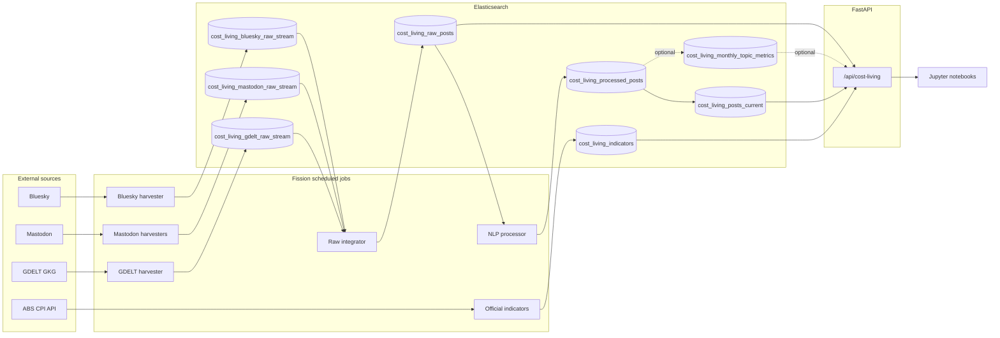

# System Architecture

The platform monitors Australian cost-of-living pressure using public social posts, media coverage and official CPI indicators. It has two runtime layers:

- Fission scheduled jobs for ingestion, raw integration, NLP processing and CPI updates.
- A single FastAPI REST API for all dashboard and notebook reads.

Fission is not used as a duplicate HTTP API layer in the public version.

## Flow

## Design Choices

Source metadata is centralised in [backend/common/source_registry.py](../../backend/common/source_registry.py). The registry records source names, source groups, configured raw indices, platform raw indices and source labels. The raw integrator, NLP worker and analytics API all read from the same registry.

The API reads processed data through the `cost_living_posts_current` alias. This keeps frontend paths stable when the processed index is rebuilt.

The raw and processed indices are separate. Failed NLP processing does not remove the original raw record, and status fields in the raw index make the pipeline inspectable.

## Indices

| Index or alias | Purpose | Main writer | Main reader |
| --- | --- | --- | --- |
| `cost_living_bluesky_raw_stream` | Bluesky raw records | Bluesky harvester | raw integrator |
| `cost_living_mastodon_raw_stream` | Mastodon raw records | Mastodon harvesters | raw integrator |
| `cost_living_gdelt_raw_stream` | GDELT raw records | GDELT harvester | raw integrator |
| `cost_living_raw_posts` | Unified raw records and processing state | raw integrator | NLP processor, status API |
| `cost_living_processed_posts` | Cleaned topic and sentiment records | NLP processor | API through alias |
| `cost_living_posts_current` | Stable read alias | alias update | API |
| `cost_living_indicators` | ABS CPI observations | official indicator harvester | comparison API |
| `cost_living_monthly_topic_metrics` | Optional monthly rollup | rollup script | optional API acceleration |

## Processing Semantics

Raw records start with `analysis_status = pending`. The NLP worker atomically claims records by moving them to `processing`, then writes a processed document and updates the raw record to `processed`, `discarded` or `error`.

Stable document ids make repeated harvesting idempotent. Stale `processing` records can be retried after `NLP_PROCESSING_STALE_MINUTES`.

This is an Elasticsearch-backed work queue, not a general-purpose message broker. It is adequate for the batch-oriented harvesting workload and keeps operational complexity low.

## Source Groups

| Value | Meaning |
| --- | --- |
| `social` | Bluesky and Mastodon |
| `media` | GDELT |
| `all` | all processed documents |

This distinction is important: GDELT measures media coverage, not personal sentiment.

## Adding a Source

1. Add a harvester for the new source.
2. Write source records into a source-specific raw stream index.
3. Register the source in `backend/common/source_registry.py`.
4. Add normalisation support in `scripts/import_raw_streams.py` when needed.
5. Add Fission function and timer manifests.
6. Run the raw integrator, NLP processor, API smoke test and notebook checks.

The system uses registry-based extension, not runtime plugin loading.

## Boundaries

- The social data is not a representative population survey.
- GDELT is media coverage and can be metadata-heavy.
- ABS CPI is monthly and lagged.
- Topic-to-CPI alignment is approximate.
- VADER sentiment is interpretable but limited for sarcasm and political language.
- City-level analysis is not included because source records do not provide reliable city fields.
