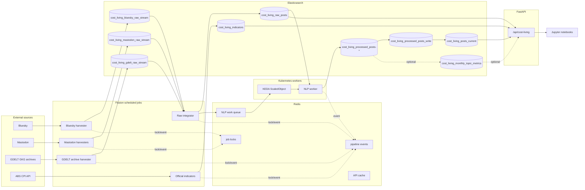

# System Architecture

The platform monitors Australian cost-of-living pressure using public social posts, media coverage and official CPI indicators. It has three runtime layers:

- Fission scheduled jobs for ingestion, raw integration and CPI updates.
- KEDA-scaled Kubernetes workers for NLP processing.
- A single FastAPI REST API for all dashboard and notebook reads.
- Redis runtime coordination for scheduled job locks, recent event diagnostics, shared API response caching and the NLP work queue.

Fission is not used as a duplicate HTTP API layer in the public version.

## Flow

## Design Choices

Source metadata is centralised in platform plugins under [backend/platforms](../../backend/platforms). [backend/common/source_registry.py](../../backend/common/source_registry.py) exposes those plugins to the raw integrator, NLP worker and analytics API.

The NLP worker writes processed data through the `cost_living_processed_posts_write` rollover alias. The API reads through `cost_living_posts_current`, so frontend paths stay stable while ILM rolls backing indices.

The GDELT path uses public GKG archive files, not rate-limited article search as the production data path. Incremental harvesting and historical backfill both call [backend/harvesters/gdelt_archive.py](../../backend/harvesters/gdelt_archive.py), which reads the master file list, downloads `.gkg.csv.zip` archives, verifies md5 checksums, filters rows and bulk indexes matching records.

The raw and processed indices are separate. Failed NLP processing does not remove the original raw record, and status fields in the raw index make the pipeline inspectable.

## Indices

| Index or alias | Purpose | Main writer | Main reader |
| --- | --- | --- | --- |
| `cost_living_bluesky_raw_stream` | Bluesky raw records | Bluesky harvester | raw integrator |
| `cost_living_mastodon_raw_stream` | Mastodon raw records | Mastodon harvesters | raw integrator |
| `cost_living_gdelt_raw_stream` | GDELT raw records | GDELT harvester | raw integrator |
| `cost_living_raw_posts` | Unified raw records and processing state | raw integrator | KEDA NLP worker, status API |
| `cost_living_processed_posts_write` | Processed write alias | KEDA NLP worker | Elasticsearch rollover |
| `cost_living_processed_posts-*` | Cleaned topic and sentiment backing indices | write alias | API through read alias |
| `cost_living_posts_current` | Stable read alias | alias update | API |
| `cost_living_indicators` | ABS CPI observations | official indicator harvester | comparison API |
| `cost_living_monthly_topic_metrics` | Optional monthly rollup | rollup script | optional API acceleration |

## Processing Semantics

Raw records start with `analysis_status = pending`. The NLP worker atomically claims records by moving them to `processing`, then writes a processed document and updates the raw record to `processed`, `discarded` or `error`.

Stable document ids make repeated harvesting idempotent. Stale `processing` records can be retried after `NLP_PROCESSING_STALE_MINUTES`.

Elasticsearch stores document processing state because the raw documents and status fields need to be queryable together. Redis is used at a different layer: distributed locks prevent overlapping timer executions, a short event queue records job lifecycle events with a `run_id`, the API can share short-lived analytics cache entries across replicas, and KEDA watches the NLP queue depth to scale worker pods.

## Runtime Queue and KEDA Worker

When `REDIS_ENABLED=true`, each Fission ingestion job:

1. tries to acquire a Redis lock for its job name;
2. emits a `started` event;
3. runs the harvester or raw integrator;
4. emits `succeeded`, `failed` or `skipped` events;
5. releases the lock.

The raw integrator queues NLP work items after writing new unified raw records. KEDA scales `cost-living-platform-nlp-worker` from zero based on `cost_living_pipeline:queue:nlp` length. Worker pods consume messages, atomically claim pending raw documents and emit lifecycle events.

Worker messages have a bounded retry budget controlled by `NLP_QUEUE_MAX_ATTEMPTS`. Transient processing failures are requeued with attempt metadata and the latest error. Messages that exceed the retry budget, cannot be decoded or use an unsupported kind are moved to `cost_living_pipeline:queue:nlp:dead-letter` with the original payload and failure reason.

The API exposes runtime configuration at `/api/cost-living/pipeline/runtime`, queue depth at `/api/cost-living/pipeline/queues`, recent lifecycle events at `/api/cost-living/pipeline/events`, Prometheus metrics at `/api/cost-living/metrics`, rate limit status at `/api/cost-living/rate-limit/status` and cache status at `/api/cost-living/cache/status`.

## Source Groups

| Value | Meaning |
| --- | --- |
| `social` | Bluesky and Mastodon |
| `media` | GDELT |
| `all` | all processed documents |

GDELT measures media coverage, not personal sentiment, so social and media analytics should be interpreted separately.

## Adding a Source

1. Add a harvester for the new source.
2. Write source records into a source-specific raw stream index.
4. Add normalisation support in `scripts/import_raw_streams.py` when needed.
5. Add Fission function and timer manifests.
6. Run the raw integrator, KEDA NLP worker, API smoke test and notebook checks.

The system uses registry-based extension, not runtime plugin loading.

## Boundaries

- The social data is not a representative population survey.
- GDELT is media coverage and can be metadata-heavy.
- ABS CPI is monthly and lagged.
- Topic-to-CPI alignment is approximate.
- VADER sentiment is interpretable but limited for sarcasm and political language.
- City-level analysis is not included because source records do not provide reliable city fields.
